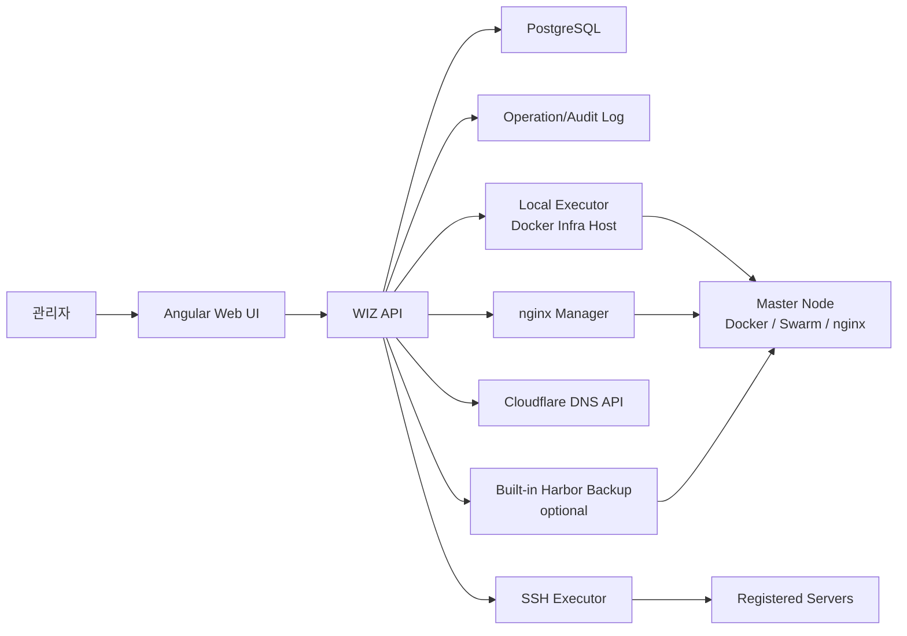

# Docker Infra 설계 문서

- 문서 상태: 구조 단순화 반영
- 기준일: 2026-05-08
- 대상: 미니 PC/데스크탑 형태로 패키징해 판매하는 단일 운영 장비형 Docker Infra

## 1. 제품 목표

Docker Infra는 개발자가 아닌 전산 담당자 또는 일반 관리자가 Docker 기반 서비스를 쉽게 운영하도록 돕는 웹 서비스다. 사용자는 IP, port, domain, image tag 정도의 기본 지식만으로 서버 등록, 서비스 배포, 도메인 연결, 인증서 적용, 이미지 백업을 처리할 수 있어야 한다.

핵심 목표는 다음과 같다.

- Docker Infra가 실행되는 서버를 마스터 노드로 자동 등록한다.
- 추가 서버는 SSH 연결 확인, key 준비, Swarm join까지 가능한 한 자동화한다.
- 서비스 생성은 YAML 편집기가 아니라 마법사와 폼 중심으로 제공한다.
- 이미 만들어진 이미지를 선택해 Docker Compose 기반으로 배포한다.
- nginx는 Ubuntu 24.04 기본값으로 고정하고, 설정 파일 원문은 고급 모드에만 둔다.
- 도메인과 서비스 연결은 폼으로 처리하고, nginx 설정은 자동 생성한다.
- Harbor는 외부 연동 대상이 아니라 선택형 내장 서비스 이미지 백업/버전 관리 시스템으로 사용한다.
- 긴 실행 결과는 lightweight operation log, audit log, streaming output으로 관리한다.

## 2. 범위와 비범위

### 범위

- password-only 단일 관리자 로그인
- 최초 구성 마법사
- 마스터 노드 자동 등록
- 서버 추가, SSH key 준비, fingerprint 저장, Docker/Swarm 상태 확인
- 서버 상세 metric, 컨테이너 목록, 컨테이너 실행/중지/재시작
- 전역 매크로와 서버 전용 매크로 관리, Monaco 편집, streaming 실행 결과
- 서버별 웹 터미널
- 서비스 생성/수정 마법사
- Compose 템플릿 관리
- 서비스 배포, 수정, 롤백
- 도메인 관리, Cloudflare DNS record 동기화와 CRUD
- 도메인별 인증서 업로드와 만료일 분석
- 서비스 화면의 certbot 무료 인증서 발급
- nginx server block 자동 생성, 검증, reload, rollback
- 로컬 이미지 목록과 사용/미사용 정리
- 선택형 내장 Harbor 백업 시스템
- 시스템 설정의 브랜드 이미지, 백업 시스템 상태, 이미지 정리 정책

### 비범위

- Kubernetes 클러스터 직접 관리
- 멀티 마스터 Swarm 구성
- 마스터 노드를 별도 서버로 지정하거나 변경하는 기능
- 소스 저장소 연동, git clone, Docker build, registry push 파이프라인
- 등록 서버 밖의 registry 프로젝트를 일반 운영자가 직접 관리하는 화면
- 다른 웹서버 선택
- nginx 설치 경로, daemon 이름, sites 디렉토리 편집
- 사용자 계층, 사용자 관리, RBAC
- 기본 화면에서 YAML 또는 nginx config 원문 작성을 요구하는 흐름

## 3. 설계 원칙

1. **마법사와 폼이 기본이다.**
   사용자는 서비스 이름, 이미지, 버전, 포트, 도메인, 환경변수, 볼륨, 서버 선택만 입력한다. Compose YAML과 nginx config 원문은 고급 모드에서만 노출한다.

2. **이미 존재하는 이미지만 배포한다.**
   Docker Infra는 이미지를 직접 빌드하지 않는다. 이미지 생성은 외부 CI/CD 또는 수동 빌드가 담당하고, Docker Infra는 운영 배포와 백업 버전 관리만 담당한다.

3. **Docker Infra 실행 서버가 기준점이다.**
   이 서버는 local master, nginx host, 도메인 진입점, 선택형 백업 저장소 host 역할을 한다.

4. **위험 작업은 짧게 실행하고 기록한다.**
   배포, 컨테이너 제어, nginx reload, certbot, 이미지 삭제, 백업 정리 결과는 operation log와 audit log로 남긴다. 화면에 실시간 출력이 필요한 경우에는 streaming response 또는 WebSocket을 사용한다.

5. **비활성화된 연동도 기본 운영을 막지 않는다.**
   Cloudflare token이 없어도 수동 도메인 관리는 가능해야 하고, 백업 시스템이 꺼져도 서비스 배포와 로컬 이미지 관리는 가능해야 한다.

## 4. 아키텍처

| 구성 요소 | 역할 |
|---|---|
| Web UI | 서버, 서비스, 도메인, 이미지, 템플릿, 시스템 설정 화면 |
| WIZ API | 인증, 설정, DB 접근, Docker/SSH/nginx/Cloudflare 작업 조율 |
| PostgreSQL | 설정, 서버, 서비스, 도메인, 인증서, 이미지, 작업 결과 저장 |
| Local Executor | Docker Infra host에서 Docker, Swarm, nginx, certbot 명령 실행 |
| SSH Executor | 등록 서버 접속 확인, key 설치, 원격 Docker 상태 조회, PTY 중계 |
| nginx Manager | Ubuntu 24.04 기본 nginx 설정 생성, 검증, reload, rollback |
| Built-in Harbor Backup | 선택 시 마스터 노드에 실행되는 서비스 이미지 백업 저장소 |
| Operation/Audit Log | 실행 결과, 위험 작업 요청, 오류 요약 저장 |

## 5. 데이터 모델 방향

주요 테이블은 다음 기준으로 정리한다.

| 테이블 | 주요 필드 | 설명 |
|---|---|---|
| `system_settings` | `key`, `value`, `value_type`, `is_secret` | 브라우저 title, 설치 상태, 정리 정책 등 |
| `backup_system_settings` | `enabled`, `status`, `data_path`, `used_bytes`, `available_bytes` | 내장 Harbor 백업 시스템 상태 |
| `cloudflare_zones` | `domain`, `zone_id`, `api_token_enc`, `enabled` | 도메인별 Cloudflare 설정 |
| `cloudflare_dns_records` | `zone_config_id`, `record_type`, `record_name`, `content`, `proxied`, `ttl` | DNS record cache |
| `domain_certificates` | `domain_id`, `cert_path`, `key_path`, `expires_at`, `issuer`, `status` | 도메인별 업로드 인증서 |
| `nodes` | `name`, `host`, `ssh_port`, `username`, `ssh_key_path`, `fingerprint`, `is_local_master`, `status` | 서버 등록 정보 |
| `node_metrics` | `node_id`, `cpu_pct`, `memory_pct`, `storage_pct`, `sampled_at` | 최신 metric |
| `services` | `namespace`, `name`, `description`, `status`, `target_node_id` | 서비스 기본 정보 |
| `service_domains` | `service_id`, `domain_id`, `hostname`, `internal_port`, `ssl_mode`, `nginx_config_id` | 서비스와 도메인 연결 |
| `compose_versions` | `service_id`, `version`, `path`, `checksum`, `created_at` | Compose 버전 이력 |
| `templates` | `name`, `description`, `image_name`, `image_version`, `input_schema` | 서비스 템플릿 |
| `template_versions` | `template_id`, `version`, `compose_path`, `created_at` | 명시적 템플릿 릴리즈 |
| `local_images` | `node_id`, `repository`, `tag`, `image_id`, `size`, `created_at`, `last_used_at` | 서버별 로컬 이미지 cache |
| `service_image_backups` | `service_id`, `source_image`, `backup_image`, `digest`, `size`, `created_at` | 서비스 이미지 백업 버전 |
| `proxy_configs` | `service_domain_id`, `config_path`, `content`, `checksum`, `active` | nginx 설정 이력 |
| `operation_logs` | `type`, `target_type`, `target_id`, `status`, `message`, `started_at`, `finished_at` | 실행 결과 요약 |
| `audit_logs` | `action`, `target_type`, `target_id`, `payload_summary`, `result`, `created_at` | 위험 작업 감사 로그 |

기존 다단계 작업 큐용 테이블은 제거하거나 deprecated 처리한다.

## 6. 최초 구성

첫 접속 시 설치 마법사는 다음만 받는다.

1. 관리자 비밀번호
2. 서비스 백업 시스템 구성 여부

마법사는 다음을 자동 처리한다.

- Docker Infra 실행 서버를 local master로 등록
- Docker daemon 상태 확인
- Swarm manager 상태 확인과 필요 시 초기화
- `docker_infra_overlay` network 준비
- Ubuntu 24.04 기본 nginx 설치/실행 상태 확인
- 백업 시스템을 활성화한 경우 마스터 노드에 Harbor Compose 실행
- 백업 저장소 data directory와 남은 용량 표시

백업 시스템은 기본 비활성화다. 비활성화해도 서비스 배포, 도메인 연결, 로컬 이미지 관리는 정상 동작해야 한다.

## 7. 서버 관리

서버 추가 모달은 다음 입력만 요구한다.

- 서버 이름
- IP 또는 host
- SSH port
- SSH 계정
- 최초 연결용 비밀번호

등록 흐름은 다음과 같다.

1. password SSH 연결 확인
2. host fingerprint 확인
3. 관리용 SSH key file 자동 생성 또는 기존 key 사용
4. 공개키를 원격 서버에 등록
5. DB에는 key file 경로와 fingerprint만 저장
6. Docker 설치 여부와 daemon 상태 확인
7. Swarm join 자동 실행 또는 안내
8. 결과 요약과 다음 작업 버튼 표시

서버 상세는 처음 진입 시 기본 정보와 컨테이너 목록을 불러오고, 이후 자동 갱신은 CPU, memory, storage 같은 metric 전용 API만 사용한다.

## 8. 서비스 생성과 배포

서비스 화면의 기본 흐름은 마법사다.

1. 서비스 이름과 설명
2. 이미지 선택
3. 버전/tag 선택
4. 내부 포트 자동 감지 또는 선택
5. 등록된 도메인 선택 또는 신규 도메인 연결
6. SSL 방식 선택
7. 환경변수 폼 입력
8. 볼륨/데이터 보관 폴더 선택
9. 실행 서버 또는 자동 배치 선택
10. 최종 요약과 배포

고급 모드는 다음 경우에만 펼친다.

- Compose YAML 원문 확인/수정
- nginx config 원문 확인/수정
- template input schema 직접 수정

배포 전 검증은 다음을 확인한다.

- image와 tag가 비어 있지 않음
- 내부 포트가 서비스/도메인 연결에 매핑됨
- `container_name`처럼 운영 충돌이 큰 옵션은 warning 또는 차단 정책을 명확히 표시
- healthcheck가 없으면 사용자에게 영향과 권장 설정을 안내
- nginx 연결이 필요한 domain과 SSL 상태가 확인됨

배포 결과는 화면에 streaming 또는 polling으로 표시하고, 완료 후 서비스 상태, 컨테이너 상태, health check, nginx, domain 상태를 즉시 갱신한다.

## 9. 서비스와 도메인, nginx

nginx는 Ubuntu 24.04 기본값으로 고정한다.

| 항목 | 값 |
|---|---|
| daemon | `nginx` |
| main config | `/etc/nginx/nginx.conf` |
| sites available | `/etc/nginx/sites-available` |
| sites enabled | `/etc/nginx/sites-enabled` |
| reload | `systemctl reload nginx` |
| config test | `nginx -t` |

서비스와 도메인 연결은 nginx 원문 작성이 아니라 폼으로 처리한다.

- 서비스 생성/수정 마법사에서 등록된 도메인을 선택한다.
- 필요한 경우 같은 마법사에서 신규 도메인 연결로 이동한다.
- 내부 포트, hostname, SSL 방식을 선택한다.
- 화면은 `https://app.example.com 접속 시 service-a:8080으로 연결됨` 같은 helper를 보여준다.
- 저장 시 `service_domains` row를 만들고 nginx server block을 생성한다.
- `nginx -t`가 성공하면 reload한다.
- reload 실패 시 이전 설정으로 복원한다.
- 원문 편집은 고급 모드에서만 제공한다.

도메인 화면은 Cloudflare DNS와 인증서를 관리한다.

- Cloudflare token이 있으면 DNS record 동기화와 CRUD를 수행한다.
- token이 없어도 수동 도메인과 인증서 관리는 가능하다.
- 인증서는 도메인별로 cert/key 파일을 업로드하고 만료일, SAN, issuer, key matching 상태를 분석한다.
- 인증서가 없는 도메인은 서비스 화면에서 certbot 무료 인증서를 발급할 수 있다.

## 10. 이미지와 내장 백업 시스템

이미지 관리는 다음 두 축으로 나눈다.

- 등록 서버의 로컬 이미지 목록
- 내장 Harbor 백업 시스템의 서비스 이미지 버전

로컬 이미지 화면은 사용/미사용 필터, 크기/생성일/마지막 사용일 정렬, 일괄 삭제를 제공한다. 삭제 전에는 영향을 받는 서비스와 컨테이너를 보여준다.

내장 Harbor 백업 시스템은 최초 구성 또는 시스템 설정에서 활성화한다.

- 마스터 노드에 Harbor Compose를 실행한다.
- 관리자 계정과 token은 내부 secret으로 관리하고 일반 화면에 노출하지 않는다.
- 서비스 배포 시 사용 이미지와 digest를 기록한다.
- 백업이 활성화되어 있으면 서비스 이미지를 내부 Harbor에 저장한다.
- 동일 digest는 중복 백업하지 않는다.
- 서비스 상세에서 백업 버전과 복원 버튼을 제공한다.
- 시스템 설정에서 미사용 N일 이상 이미지 삭제, 서비스에서 사용하지 않는 이미지 삭제, 백업 시스템 정지 기능을 제공한다.

## 11. 시스템 설정

시스템 설정은 다음만 담당한다.

- Browser title
- Favicon
- Logo
- 백업 시스템 활성화/비활성화와 상태
- 백업 storage 사용량과 남은 용량
- 이미지 정리 정책
- 위험 작업 audit log 확인

Favicon과 Logo는 고정 URL로 제공한다. 파일명과 URL을 설정값으로 저장하지 않고, 업로드 시 WIZ root `data/system-assets/` 아래의 고정 파일을 교체한다.

nginx 경로, daemon 이름, 사이트 설정 디렉토리, SSL 인증서 업로드는 시스템 설정에서 다루지 않는다.

## 12. 매크로와 터미널

매크로는 전역 메뉴에서 관리하고, 서버 상세에서는 실행 중심으로 제공한다. 서버 전용 매크로는 해당 서버 상세의 매크로 탭에서만 보인다.

- 매크로 편집기는 Monaco editor를 사용한다.
- editor theme은 웹 사이트 dark mode 상태를 따른다.
- macOS는 `Cmd+S`, Windows/Linux는 `Ctrl+S`로 저장한다.
- 실행 인자는 기본 비활성화이며, 체크박스를 켰을 때만 input을 표시한다.
- 실행 결과는 모달이 아니라 서버 상세 탭 안에서 streaming으로 표시한다.

웹 터미널은 서버 상세 탭에서 `터미널 연결` 버튼을 눌렀을 때만 연결한다. SSH 대상 서버의 기본 shell, ANSI color, unicode, resize, reconnect를 최대한 실제 터미널과 같게 처리한다.

## 13. 보안과 로그

- 관리자 로그인은 password-only지만 password는 해시로 저장한다.
- SSH 최초 비밀번호는 연결과 key 설치에만 사용하고 DB에 저장하지 않는다.
- DB에는 SSH key file 경로와 fingerprint만 저장한다.
- Cloudflare token, backup system secret은 암호화 저장한다.
- API 응답과 devlog에는 password/token 같은 민감 정보를 남기지 않는다.
- 위험 작업은 audit log에 요약 저장한다.
- streaming output은 화면 표시가 목적이며, 영구 저장 범위는 operation summary로 제한한다.

## 14. API 방향

API는 화면 중심의 굵은 흐름으로 제공한다.

- `/api/system/setup`: 최초 구성, local master 등록, 백업 시스템 선택
- `/api/system/appearance`: 앱 부트 시 1회 로드하는 title/favicon/logo 상태
- `/api/system/backup`: 백업 시스템 상태, 시작/정지/정리
- `/api/nodes`: 서버 등록, 수정, 상태 조회, metric refresh
- `/api/nodes/{id}/terminal`: 웹 터미널 연결
- `/api/services`: 서비스 목록, 생성 마법사, 수정, 배포, 롤백
- `/api/services/{id}/domains`: 서비스와 도메인/nginx 연결
- `/api/domains`: Cloudflare zone, DNS record, 인증서 관리
- `/api/images`: 로컬 이미지와 백업 이미지 조회/삭제
- `/api/templates`: 템플릿과 명시적 릴리즈 관리
- `/api/operations`: operation log와 audit log 조회

OpenAPI는 이 기준으로 정리하고, 제거된 다단계 작업 큐 API는 문서와 테스트에서 제외한다.

## 15. 구현 순서

1. 방향 전환 문서 정리
2. 기존 다단계 작업 큐 의존 제거
3. 최초 구성 마법사와 내장 백업 시스템 선택 흐름
4. 내장 Harbor 백업 시스템
5. 서비스 이미지 백업과 복원
6. 서비스 생성 마법사
7. 서비스 배포, 수정, 롤백
8. nginx, 도메인, SSL 연결
9. 서버 관리 마무리
10. 이미지 관리 재정의
11. 시스템 설정 재정의
12. 템플릿, 매크로, 터미널 안정화
13. DB/API 계약과 테스트 갱신

## 16. 남은 결정

- 서비스 배포 엔진을 `docker stack deploy` 기준으로 유지할지, 단순 `docker compose up -d` 기준으로 줄일지 결정한다.
- 내장 Harbor data directory를 WIZ root `data/backup-harbor/`로 둘지 운영 volume으로 분리할지 결정한다.
- certbot 인증서 자동 갱신을 API polling으로 처리할지 별도 scheduler로 둘지 결정한다.
- nginx reload 권한을 container에서 host로 어떻게 안전하게 위임할지 설치 패키징 기준을 확정한다.
