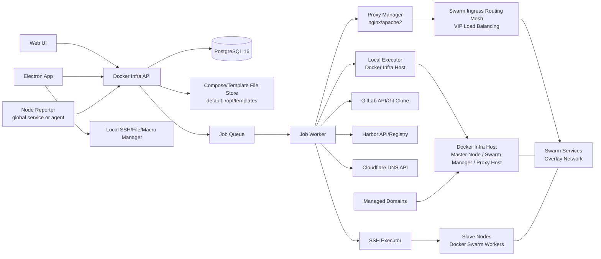
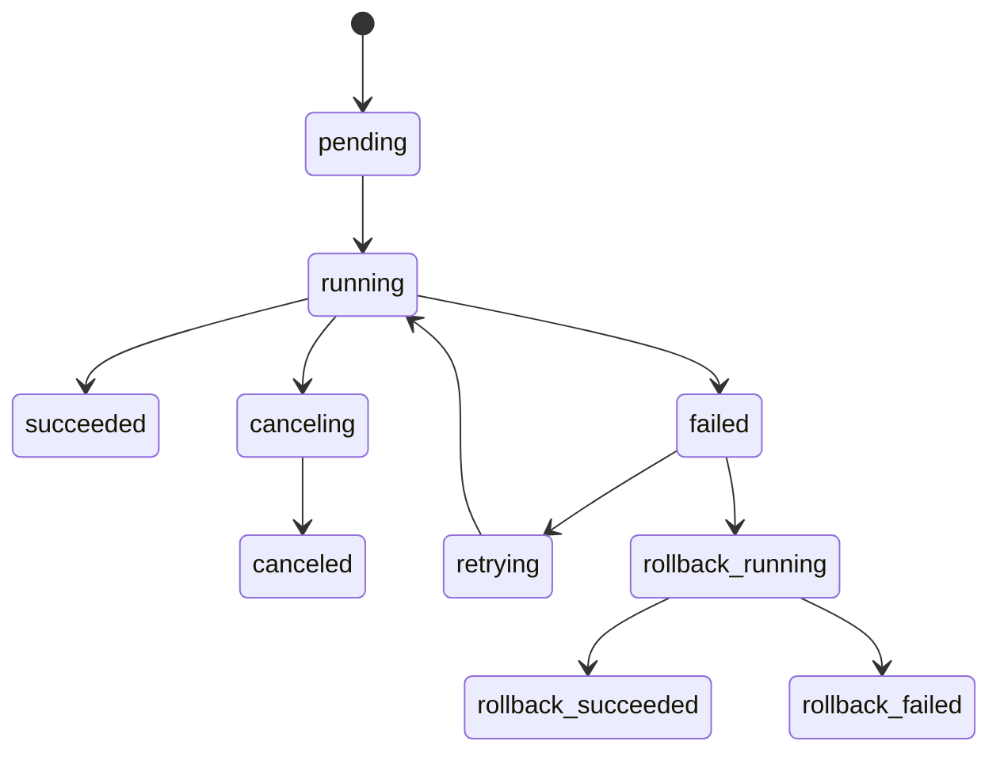
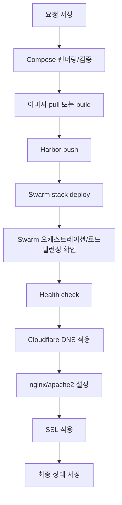

# Docker Infra 핵심 설계 문서

- 문서 상태: 초안
- 기준일: 2026-05-06
- 대상: Docker Infra 웹 서비스, 백그라운드 작업자, Electron 앱

## 1. 목적

Docker Infra는 Kubernetes 운영 환경과 최대한 비슷한 개발/검증 환경을 Docker 기반으로 제공하는 인프라 관리 서비스다.

기존 Kubernetes 환경은 서버 클러스터링, 배포, 네트워크 오케스트레이션에 강점이 있지만 개발 과정에서 `docker commit`, 로컬 SSH 자동화, 파일 전송, 쉘 매크로 실행처럼 Docker 개발 환경에서 자주 필요한 기능을 직접 활용하기 어렵다. Docker Infra는 서버들을 Docker Swarm으로 묶고, Docker Compose를 배포 단위로 삼아 개발 편의성과 운영 환경 유사성을 함께 확보한다.

핵심 방향은 다음과 같다.

- 개발자는 Docker Compose 중심으로 서비스를 만들고 배포한다.
- Docker Infra 서비스가 실행되는 서버를 단일 마스터 노드이자 Swarm manager로 삼고, 여기에 N개의 슬레이브 노드를 join시켜 관리한다.
- Cloudflare DNS, Docker Infra 실행 서버의 nginx/apache2, SSL 설정까지 하나의 배포 흐름으로 자동화한다.
- GitLab 소스와 Harbor 이미지 저장소를 연동해 빌드, push, 배포, health check 이력을 보존한다.
- 웹 서비스와 Electron 앱을 함께 제공해 원격 인프라 관리와 로컬 PC 기반 SSH 자동화를 모두 지원한다.

## 2. 범위와 비범위

### 2.1 포함 범위

- 서버 등록, SSH 접속 확인, Docker Swarm join 자동화
- 서버 상태 모니터링, 컨테이너 목록 조회, 웹 터미널
- 전역 쉘 매크로 관리와 서버 전용 쉘 매크로 저장, Monaco 편집, 인자 입력 실행
- Docker Compose 템플릿 관리, 서비스 생성, 배포, 이력 관리
- GitLab 프로젝트 연동, 이미지 빌드, Harbor push 및 이미지 목록 조회
- Cloudflare DNS 관리
- Docker Infra 실행 서버의 nginx/apache2 설정 관리
- SSL 인증서 적용: 구매 인증서 업로드 또는 certbot 발급/갱신
- 배포 플로우의 큐 기반 백그라운드 작업화와 단계별 로그 보존
- 시스템 설정 및 최초 설치 마법사
- Electron 앱: 로컬 모드와 원격 모드

### 2.2 제외 범위

- Kubernetes 클러스터 직접 관리
- 멀티 마스터 Swarm 구성
- 마스터 노드를 별도 서버로 지정하거나 변경하는 기능
- 여러 서버에 분산 설치된 nginx/apache2 관리
- 사용자 계층, 사용자 관리, 권한 관리, RBAC
- 단일 Dockerfile만으로 서비스를 등록하거나 배포하는 방식
- 첫 버전에서의 자체 분산 파일 시스템 구현

## 3. 설계 원칙

1. **Docker Compose가 서비스의 기준이다.**
   서비스 생성, 템플릿, GitLab 빌드, Swarm 배포는 모두 Compose 파일을 중심으로 동작한다.

2. **서버 변경은 작업(Job)으로 기록한다.**
   SSH 명령, Swarm join, 이미지 빌드, DNS 변경, proxy reload, SSL 적용은 모두 작업과 작업 단계로 저장하고 로그를 남긴다.

3. **연동 기능은 선택 사항이다.**
   GitLab, Harbor, Cloudflare 설정 여부에 따라 메뉴와 기능을 동적으로 활성화한다.

4. **Docker Infra 실행 서버가 마스터 노드다.**
   별도의 마스터 서버를 지정하지 않는다. Docker Infra 서비스가 실행되는 서버가 Swarm manager, proxy host, 도메인 진입점 역할을 함께 수행한다.

5. **직접 파일과 DB 메타데이터를 분리한다.**
   Compose와 템플릿 파일은 파일시스템에 저장하고, 검색/상태/이력/단일 운영 정보는 PostgreSQL에 저장한다.

6. **사용자 계층은 만들지 않는다.**
   첫 버전뿐 아니라 이후 버전에서도 사용자 관리와 권한 계층은 도입하지 않는다. 접속은 ID 없는 단일 패스워드 모델로 고정한다.

## 4. 전체 아키텍처



### 4.1 주요 컴포넌트

| 컴포넌트 | 책임 |
|---|---|
| Web UI | 서버, 서비스, 도메인, 이미지, 템플릿, 시스템 설정 관리 화면 제공 |
| API 서버 | 인증, 설정, 메타데이터, 파일 브라우저, 작업 생성, 통합 API 제공 |
| PostgreSQL 16 | 설정, 서버, 서비스, 템플릿, 작업, 로그, 이력, 메트릭 메타데이터 저장 |
| Job Queue | 긴 작업을 비동기로 실행하고 단계별 상태를 관리 |
| Job Worker | SSH, GitLab, Harbor, Cloudflare, proxy, SSL 작업 실행 |
| Local Executor | Docker Infra 실행 서버에서 Swarm, Docker, nginx/apache2 명령 실행 |
| SSH Executor | 슬레이브 서버 접속 확인, 명령 실행, 파일 전송, PTY 세션 중계 |
| Proxy Manager | Docker Infra 실행 서버의 nginx/apache2 감지, 설정 생성/검증/reload/rollback |
| Node Reporter | 각 서버 상태와 컨테이너 요약 정보를 주기적으로 API에 전송 |
| Compose/Template Store | 서비스별 Compose 파일, 템플릿, 부가 파일, `.history` 저장 |
| Electron App | 로컬 SSH 관리 및 원격 Docker Infra 기능 제공 |

## 5. 데이터베이스

PostgreSQL 16을 사용한다. 프로젝트 기준 개발 DB 컨테이너는 `docker/compose/development.yaml`에, 테스트 DB 컨테이너는 `docker/compose/test.yaml`에 분리한다. 개발 DB는 named volume으로 유지하고, 테스트 DB는 disposable PostgreSQL 컨테이너와 `docker_infra_test` schema를 사용한다. 비밀번호는 compose 기본값으로만 개발 편의를 제공하며 운영 구성에서는 환경변수나 secret으로 분리한다.

### 5.1 핵심 테이블 초안

| 테이블 | 주요 필드 | 설명 |
|---|---|---|
| `system_settings` | `key`, `value`, `value_type`, `is_secret` | 브라우저 제목, 로고, 설치 상태, 기본 경로 등 |
| `integration_harbor` | `url`, `username`, `password_enc`, `enabled` | Harbor 연동 설정 |
| `integration_gitlab` | `url`, `token_enc`, `enabled` | GitLab 연동 설정 |
| `cloudflare_zones` | `domain`, `zone_id`, `api_token_enc`, `usable_for_service`, `enabled` | 도메인별 Cloudflare 설정 |
| `cloudflare_dns_records` | `zone_config_id`, `cloudflare_record_id`, `record_type`, `record_name`, `content`, `proxied`, `ttl` | Cloudflare DNS 레코드 캐시와 마지막 동기화 값 |
| `nodes` | `name`, `role`, `host`, `ssh_port`, `auth_type`, `status`, `swarm_node_id`, `is_local_master` | Docker Infra host와 슬레이브 서버 정보 |
| `node_credentials` | `node_id`, `username`, `key_file`, `ssh_fingerprint` | 슬레이브 SSH 접속용 관리 key file과 fingerprint 정보 |
| `node_metrics` | `node_id`, `cpu`, `memory`, `storage`, `containers`, `reported_at` | 서버 상태 시계열 요약 |
| `templates` | `name`, `namespace`, `path`, `description`, `enabled` | Compose 템플릿 카탈로그 |
| `template_versions` | `template_id`, `version`, `path`, `created_at` | 템플릿 버전 |
| `services` | `namespace`, `name`, `status`, `compose_path`, `stack_name`, `target_node_policy` | 서비스 메타데이터 |
| `service_domains` | `service_id`, `domain`, `port`, `proxy_type`, `ssl_mode` | 서비스별 도메인/proxy 설정 |
| `compose_versions` | `service_id`, `version`, `path`, `checksum`, `created_at` | 서비스 Compose 버전 이력 |
| `images` | `registry`, `project`, `name`, `tag`, `digest`, `source` | Harbor/로컬 이미지 메타데이터 |
| `image_builds` | `service_id`, `gitlab_project_id`, `compose_file_path`, `build_node_id`, `status` | 이미지 빌드 작업 요약 |
| `jobs` | `type`, `status`, `requested_payload`, `started_at`, `finished_at` | 백그라운드 작업 |
| `job_steps` | `job_id`, `name`, `status`, `order_no`, `started_at`, `finished_at` | 작업 단계 |
| `job_logs` | `job_id`, `step_id`, `stream`, `message`, `created_at` | 단계별 로그 |
| `proxy_configs` | `service_id`, `proxy_type`, `config_path`, `content`, `active`, `checksum` | nginx/apache2 설정 이력 |
| `certificates` | `service_domain_id`, `mode`, `cert_path`, `key_path`, `expires_at`, `status` | 인증서 관리 |
| `electron_setting_backups` | `name`, `payload_enc`, `created_at` | Electron 로컬 설정 백업 |

### 5.2 저장 원칙

- 비밀번호, token, private key, 인증서 key는 암호화해 저장한다.
- 로그에 secret 값이 출력될 수 있는 명령은 실행 전후로 masking 규칙을 적용한다.
- Compose 파일 본문은 파일시스템이 원본이고 DB에는 경로, checksum, 버전, 상태만 저장한다.
- 작업 payload에는 재실행에 필요한 값만 저장하고 secret은 참조 ID로만 연결한다.

## 6. 서버 및 Swarm 관리

### 6.1 서버 구성

- Docker Infra 서비스가 실행되는 서버 1개가 곧 마스터 노드
- 슬레이브 노드 N개
- Docker Infra 실행 서버에는 nginx 또는 apache2가 설치되어 있다는 전제
- Docker Infra는 실행 서버에는 local command로, 슬레이브 노드에는 SSH로 명령을 실행
- 모든 Swarm 서비스는 고정 overlay network에 연결

권장 기본 network 이름은 `docker_infra_overlay`다. 서비스 템플릿과 생성된 Compose 파일은 이 network를 외부 network로 참조한다.

마스터 노드를 별도 화면에서 지정하지 않는다. 설치 마법사는 현재 Docker Infra가 실행 중인 서버의 Docker daemon, Swarm manager 상태, nginx/apache2 설치 상태를 점검하고, Swarm이 초기화되어 있지 않으면 이 서버에서 `docker swarm init`을 실행한다.

Docker Infra가 컨테이너로 실행되는 경우에도 마스터 노드 제어 대상은 컨테이너가 아니라 Docker Infra 컨테이너를 실행한 host 서버다. 따라서 Docker socket, proxy 설정 디렉토리, 인증서 디렉토리, 또는 localhost SSH 같은 host 제어 경로가 설치 단계에서 검증되어야 한다.

### 6.2 서버 등록 흐름

1. 설치 시 Docker Infra 실행 서버를 local master로 자동 등록
2. local master의 Docker 설치 여부, Docker daemon 상태, Swarm manager 상태, nginx/apache2 설치 여부 확인
3. Swarm이 초기화되어 있지 않으면 local master에서 `docker swarm init` 실행
4. 슬레이브 서버 등록 시 IP, SSH 포트, 계정, 최초 연결용 password 입력
5. password로 접속 가능 여부를 확인한 뒤 SSH fingerprint를 확인하고, 관리용 SSH key file이 없으면 자동 생성해 서버에 등록
6. local master에서 join token 조회
7. 슬레이브 노드에서 `docker swarm join` 실행
8. Swarm node ID, hostname, role, 상태 저장
9. 서버 상세 화면에서는 로컬 명령 또는 저장된 SSH key로 CPU/memory/storage/container 상태를 자동 갱신
10. 별도 reporter/global service 방식은 내부 연동 기능으로 유지하되 기본 운영 화면에서 직접 노출하지 않음

### 6.3 서버 상세 화면

서버 상세 화면은 다음 정보를 제공한다.

- CPU, memory, storage, network 요약
- Docker daemon 상태
- Swarm role, availability, labels
- 해당 서버에서 실행 중인 컨테이너 목록과 상태
- 로컬 이미지 목록
- 개요, 매크로, 웹 터미널 탭
- 전역 매크로와 서버 전용 매크로를 함께 선택해 실행하고 결과를 탭 내부에 확인
- 웹 터미널 xterm
- SSH 명령 실행 이력

웹 터미널은 WebSocket을 통해 API 서버와 연결하고, API 서버가 SSH PTY 세션을 중계한다. 서버 상세에서 터미널 탭을 선택해도 즉시 연결하지 않고, 운영자가 `터미널 연결` 버튼을 눌렀을 때만 세션을 연다. 터미널 출력 전체를 항상 보존하면 secret 노출 위험이 커지므로 기본값은 세션 메타데이터와 명령 시작/종료 상태만 저장하고, 작업(Job)으로 실행한 명령은 로그를 보존한다.

전역 매크로는 별도 `/macros` 메뉴에서 관리한다. 여기서 관리하는 스크립트는 여러 서버에서 재사용할 공통 작업용이다. 서버 상세의 매크로 탭은 이 전역 매크로와 해당 서버에만 연결된 서버 전용 매크로를 함께 보여주고, 검색 가능한 선택 UI로 즉시 실행한다.

### 6.4 상태 수집

각 서버 상태는 Node Reporter가 주기적으로 API에 전송한다. 초기 구현은 다음 두 방식을 지원한다.

- Swarm global service 방식: Docker Infra가 reporter 컨테이너를 모든 노드에 배포
- SSH fallback 방식: API 또는 worker가 SSH로 `docker stats`, `df`, `free`, `top` 계열 명령을 주기 실행

현재 웹 UI의 기본값은 SSH fallback과 local command 기반 자동 갱신이다. 운영자는 `/servers` 화면에서 1초, 3초, 5초, 10초 주기를 선택해 최신 상태를 볼 수 있어야 하며 reporter token 발급 자체를 직접 이해하거나 다룰 필요가 없다.

Reporter token/API는 이후 global service 배포나 외부 agent 연동을 위한 내부 기능으로 유지한다. Reporter는 node token으로 인증하고 CPU, memory, storage, container summary를 전송한다.

## 7. Docker Compose 정책

### 7.1 허용 단위

Docker Infra는 서비스 등록과 배포 단위로 Docker Compose만 허용한다. 단일 Dockerfile은 서비스 단위로 등록할 수 없다.

GitLab 빌드 과정에서 Compose의 `build` 지시자가 Dockerfile을 참조하는 것은 허용할 수 있지만, 이 경우에도 사용자가 지정하는 배포 원본은 Compose 파일이어야 한다.

### 7.2 Compose 검증 규칙

서비스 생성 전 Compose 파일은 다음 규칙을 통과해야 한다.

| 항목 | 규칙 |
|---|---|
| 파일명 | `docker-compose.yaml` 또는 `docker-compose.yml` |
| 프로젝트 이름 | 서비스 `namespace`를 기준으로 stack name 생성 |
| namespace | `^[a-z0-9_]+$` |
| service name | 필수, `namespace` 안에서 유일 |
| `container_name` | 금지 |
| `hostname` | 기본 금지 |
| network | `docker_infra_overlay` 고정 사용 |
| ports | nginx/apache2 upstream으로 연결할 published port를 서비스 설정에서 관리 |
| `deploy.replicas` | 기본값 1, 운영자가 서비스별로 조정 |
| `deploy.update_config` | rolling update 기본 정책 자동 보강 |
| `deploy.rollback_config` | 실패 시 rollback 기본 정책 자동 보강 |
| `deploy.restart_policy` | 실패 컨테이너 자동 재시작 정책 자동 보강 |
| `healthcheck` | health check 경로가 있는 서비스는 Compose healthcheck 또는 배포 Job health check 필수 |
| secret/env | UI에서 masking 처리하고 작업 로그에 원문 노출 금지 |

`host.docker.internal`이 필요한 경우에는 `extra_hosts`를 통해 제한적으로 허용한다.

`docker stack deploy` 결과물은 Swarm service로 생성되어야 하며, Docker Infra는 Compose에 기본 오케스트레이션 정책을 보강한다. replica 수, rolling update, rollback, restart policy, placement constraint를 서비스 설정과 템플릿 값으로 관리하고, nginx/apache2는 개별 컨테이너 IP가 아니라 Swarm ingress routing mesh 또는 VIP 기반 upstream으로 연결한다.

### 7.3 파일 저장 구조

서비스 Compose 파일과 부가 파일은 Docker Infra 컨테이너에 mount된 경로에 저장한다.

```text
/opt/templates/
  services/
    {namespace}/
      docker-compose.yaml
      config.env
      files/
      .history/
        20260506_153000/
          docker-compose.yaml
          config.env
          meta.json
  catalog/
    {template_namespace}/
      docker-compose.yaml
      values.schema.json
      values.default.yaml
      README.md
      files/
```

서비스 상세 화면은 이 디렉토리를 파일 트리로 보여주고 다운로드, 업로드, 파일 생성, 편집, 삭제 기능을 제공한다. Compose 편집기는 Monaco Editor를 사용한다.

## 8. 템플릿 관리

템플릿은 Helm chart와 비슷한 경험을 제공하되, 실제 렌더링 결과는 Docker Compose여야 한다.

템플릿 구성은 다음 파일을 기본으로 한다.

| 파일 | 설명 |
|---|---|
| `docker-compose.yaml` | 렌더링 대상 Compose 템플릿 |
| `values.schema.json` | 사용자가 입력할 변수 스키마 |
| `values.default.yaml` | 기본 변수값 |
| `README.md` | 템플릿 설명 |
| `files/` | Compose와 함께 복사할 부가 파일 |

자주 쓰는 DB, WAS, cache, queue 이미지는 기본 템플릿으로 제공한다. 템플릿에서 자주 쓰는 port, network, health check, volume 패턴은 기본값으로 제안하되 사용자가 생성 단계에서 수정할 수 있어야 한다.

AI Compose 생성 기능은 다음 순서로 동작한다.

1. 사용자가 서비스 목적, 필요한 DB/WAS/cache, port, domain, 환경변수 입력
2. AI가 Compose 초안 생성
3. Docker Infra 검증기가 금지 필드와 network 정책 검사
4. 사용자가 Monaco Editor에서 확인 및 수정
5. 검증 통과 후 서비스 생성 또는 템플릿 저장

AI가 생성한 파일은 자동 배포하지 않고, 반드시 사용자 확인 단계를 거친다.

## 9. 서비스 관리

### 9.1 생성 방식

서비스는 다음 세 가지 방식으로 생성한다.

1. 기본 템플릿 선택 후 변수 입력
2. 사용자가 직접 Compose 작성
3. GitLab 프로젝트에서 Compose 파일 경로 지정

생성 화면에서는 Compose 외에도 proxy와 SSL에 필요한 정보를 함께 입력한다.

- 서비스 namespace
- 서비스 이름
- 대상 서버 또는 Swarm placement 정책
- replica 수
- rolling update/rollback 정책
- 내부 서비스 port
- 외부 공개 domain
- proxy 종류: nginx 또는 apache2
- SSL 방식: 인증서 업로드 또는 certbot
- health check 경로와 timeout

### 9.2 배포 방식

Swarm 배포는 `docker stack deploy`를 기본으로 한다. Compose 파일은 Docker Infra 파일 저장소에 버전으로 저장된 뒤 Docker Infra 실행 서버, 즉 local master에서 배포된다.

`docker stack deploy` 단계에서는 Swarm의 기본 오케스트레이션과 로드밸런싱이 적용되어야 한다. Docker Infra는 서비스 설정을 Compose의 `deploy` 섹션과 published port 설정으로 반영하고, Swarm은 replica 배치, rolling update, 실패 task 재시작, routing mesh/VIP 기반 로드밸런싱을 담당한다.

nginx/apache2는 이 Swarm 로드밸런싱과 유기적으로 맞물려 설정된다. 기본 upstream은 local master의 published port를 바라보고, 실제 task 분산은 Swarm ingress routing mesh가 처리한다. 따라서 proxy 설정은 특정 컨테이너 IP에 직접 연결하지 않는다. 직접 공개되지 않아야 하는 published port는 방화벽 정책으로 80/443 또는 필요한 관리망에서만 접근 가능하게 제한한다.

배포 성공 조건은 다음을 모두 만족하는 것이다.

- Compose 검증 성공
- 이미지 pull 또는 build 성공
- Harbor push 성공
- Swarm service 생성/업데이트 성공
- Swarm routing mesh 또는 VIP 기반 load balancing 연결 확인
- health check 성공
- Cloudflare DNS 생성/수정 성공
- nginx/apache2 설정 검증 성공
- proxy reload 성공
- SSL 적용 성공

일부 단계는 설정 여부에 따라 생략될 수 있다. 예를 들어 Cloudflare 연동이 비활성화된 경우 DNS 단계는 skip 상태로 기록한다.

### 9.3 버전 관리와 rollback

서비스 디렉토리의 `.history`에 이전 Compose와 `config.env`를 모두 저장한다. 각 버전은 checksum, 생성 시간, 생성 작업 ID를 가진다.

rollback은 다음 단위로 제공한다.

- Compose 파일 이전 버전으로 복원
- proxy 설정 이전 버전으로 복원
- SSL 설정 이전 버전으로 복원
- Swarm stack 재배포

이미지 tag까지 함께 되돌릴 수 있도록 Compose 버전에는 사용된 이미지 tag와 digest를 metadata로 저장한다.

## 10. 이미지 관리

### 10.1 Harbor 연동

Harbor 연동이 활성화되면 다음 기능을 제공한다.

- 프로젝트 목록 조회
- 프로젝트별 repository/image/tag 목록 조회
- tag, digest, size, push time 표시
- 이미지 삭제 또는 보존 정책 적용은 별도 위험 작업으로 분리

Harbor 기본 프로젝트는 시스템 설정으로 둔다. 사용자 계층을 도입하지 않으므로 username 기반 프로젝트 분기 정책은 사용하지 않는다.

### 10.2 GitLab 빌드 흐름

GitLab 기반 이미지 빌드는 작업 큐로 실행한다.

1. GitLab 프로젝트 선택
2. 빌드할 서버 선택
3. 프로젝트 내 `docker-compose.yaml` 또는 `docker-compose.yml` 경로 입력
4. Compose 파일과 같은 경로의 `config.env` 조회
5. `config.env` 편집 후 저장
6. 빌드 스크립트 실행
7. Harbor 프로젝트, 이미지 이름, 버전 지정
8. Harbor push
9. 생성된 이미지 정보를 서비스 생성 또는 배포 작업에 전달

빌드 스크립트는 repository 안에 있는 표준 스크립트를 실행한다. Docker Infra는 스크립트 자체를 직접 생성하기보다 `config.env`와 실행 환경을 통제한다.

### 10.3 빌드 디버깅

빌드 작업은 단계별 로그를 실시간으로 스트리밍하고 저장한다.

- Git clone 로그
- Compose 파일 탐색 결과
- `config.env` diff 요약
- build stdout/stderr
- Harbor login/push 결과
- 실패 시 마지막 명령, exit code, 재시도 가능 여부

secret 값은 로그 저장 전 masking한다.

## 11. 도메인, Proxy, SSL 관리

### 11.1 Cloudflare DNS

도메인 등록 시 다음 정보를 저장한다.

- domain
- Zone ID
- API Token
- 서비스 생성 시 사용 가능 여부
- 활성화 여부

Cloudflare 연동이 활성화되면 Docker Infra는 Zone의 DNS record를 불러오고, record 생성/수정/삭제를 제공한다. Docker Infra에서 관리되는 서비스 domain은 기본적으로 Docker Infra 실행 서버의 public IP를 바라보도록 만든다.

### 11.2 nginx/apache2 감지

설치 마법사 또는 시스템 점검 시 Docker Infra 실행 서버에서 다음을 확인한다.

- nginx 설치 여부와 version
- apache2 설치 여부와 version
- 설정 디렉토리
- 설정 검증 명령
- reload 명령
- 현재 활성화된 virtual host 목록

nginx와 apache2가 모두 설치된 경우 시스템 기본 proxy를 설정에서 선택한다. 서비스별 proxy 종류는 기본값을 따르되 필요하면 개별 override할 수 있다.

nginx/apache2는 Docker Infra 실행 서버에 설치되어 있다는 전제에서만 관리한다. 슬레이브 노드에 설치된 proxy 서버는 감지하거나 관리하지 않는다.

### 11.3 Proxy 설정 흐름

1. 서비스 domain, Swarm service, replica 수, published port 입력
2. proxy 설정 초안 생성
3. 기존 설정과 충돌 여부 확인
4. upstream을 local master의 published port로 설정
5. Docker Infra 실행 서버에 설정 파일 반영
6. `nginx -t` 또는 `apachectl configtest` 실행
7. reload 실행
8. 실패 시 이전 설정 복원
9. 설정 이력 저장

### 11.4 SSL

SSL은 두 방식을 지원한다.

- 구매 인증서 업로드: cert/key/chain 파일 업로드 후 proxy 설정에 반영
- certbot: Cloudflare DNS 또는 HTTP challenge 기반 발급/갱신

인증서 만료일은 주기적으로 확인하고, certbot 방식은 갱신 작업을 Job으로 남긴다.

## 12. 백그라운드 작업 설계

모든 긴 작업은 Job으로 실행한다. Job은 여러 Step을 가지며 각 Step은 상태와 로그를 가진다.



### 12.1 서비스 배포 Job 표준 단계



설정이 없는 연동 단계는 실패가 아니라 `skipped`로 기록한다.

### 12.2 로그 보존 정책

- 모든 Job과 Step의 시작/종료 시간 저장
- stdout/stderr 구분 저장
- UI에서 실시간 로그 스트리밍
- 실패 Step에서 재시도 가능 여부 표시
- secret masking
- 로그 검색과 다운로드 지원

## 13. 시스템 설정과 설치 마법사

첫 구동 시 설치 마법사를 실행한다.

필수 초기 설정은 다음과 같다.

- 관리자 접속 패스워드
- Docker Infra 기본 URL
- Compose/Template 파일 저장 경로
- Docker Infra 실행 서버의 Docker daemon/Swarm manager 상태 확인
- Docker Infra 실행 서버의 public IP 또는 Swarm advertise address
- Docker Infra 실행 서버의 nginx/apache2 설치 상태 확인
- 기본 proxy 종류

선택 초기 설정은 다음과 같다.

- favicon
- browser title
- Logo Image
- Harbor URL, username, password
- GitLab URL, token
- Cloudflare domain별 Zone ID, API Token
- SSL 기본 정책

설치 완료 후에는 시스템 관리 메뉴에서 같은 설정을 수정할 수 있다.

## 14. 메뉴 설계

기본 메뉴는 다음과 같다.

- 서버 관리
- 서비스 관리
- 도메인 관리
- 이미지 관리
- 템플릿 관리
- 시스템 관리
- 도구 다운로드

연동 상태에 따른 메뉴 변경 규칙은 다음과 같다.

| 조건 | UI 변화 |
|---|---|
| Cloudflare 비활성화 | 도메인 관리에서 수동 domain/proxy 관리만 제공 |
| Harbor 비활성화 | 이미지 관리에서 각 서버 로컬 이미지 목록만 제공 |
| GitLab 비활성화 | GitLab 프로젝트 기반 빌드 버튼 숨김 |
| Electron 배포 파일 없음 | 도구 다운로드 메뉴에서 준비 중 상태 표시 |

## 15. Electron App 설계

Electron 앱은 로컬 모드와 원격 모드를 제공한다.

### 15.1 로컬 모드

Docker Infra URL 등록 없이 로컬 PC 기준으로 동작한다.

- SSH 서버 프로필 관리
- ProxyJump 설정
- SSH key 관리
- SSH fingerprint 확인 및 저장
- 서버 파일 전송
- 매크로: 쉘 스크립트 저장, 실행, 결과 확인
- 로컬 설정 백업 업로드
- 다른 PC에서 백업 설정 가져오기

로컬 secret은 OS keychain 또는 앱 내부 암호화 저장소에 보관한다.

### 15.2 원격 모드

원격 모드는 로컬 모드 기능을 유지하면서 Docker Infra 웹 서비스 API에 연결한다.

- 서버별 매크로 저장/편집/실행
- 서버 관리
- 서비스 관리
- 도메인 관리
- 이미지 관리
- 템플릿 관리
- 시스템 관리
- Job 로그 조회

원격 API 접속에는 Docker Infra URL과 패스워드가 필요하다.

## 16. 인증과 보안

Docker Infra는 사용자 ID 없이 패스워드만 입력하는 단일 운영자 모델을 사용한다. 사용자 계층, 팀, 역할, 권한 관리는 이후 버전에서도 도입하지 않는다.

최소 보안 요구사항은 다음과 같다.

- 패스워드는 hash로 저장
- 로그인 실패 rate limit 적용
- 세션 cookie는 `HttpOnly`, `Secure`, `SameSite` 적용
- SSH password/key, GitLab token, Harbor password, Cloudflare token은 암호화 저장
- SSH fingerprint 확인과 known hosts 저장
- Job 로그 secret masking
- 위험 작업은 확인 모달과 작업 이력 필수
- Electron 설정 백업은 암호화된 bundle로 저장

감사 로그와 작업 이력의 actor 값은 `system` 또는 `operator`로 통일한다. actor는 사용자 식별자가 아니라 작업 주체 구분값이며, RBAC나 사용자별 권한 모델로 확장하지 않는다.

## 17. 추후 파일 관리 시스템

추후 MinIO와 Ceph의 장점을 흡수한 파일 관리 시스템을 제공한다. 첫 버전에서는 직접 구현하지 않되, 서비스 생성 단계에서 향후 확장 가능한 인터페이스를 남긴다.

목표 기능은 다음과 같다.

- bucket 개념의 논리 저장소
- S3 호환 API
- NFS mount 지원
- 서비스 생성 시 bucket을 volume처럼 선택
- 컨테이너 실행 시 지정 bucket을 NFS로 mount
- replication 또는 erasure coding 기반 안정성
- quota, lifecycle, snapshot 정책

첫 구현 전까지는 외부 NFS 또는 외부 S3/MinIO connector를 선택적으로 연동하는 형태로 준비한다.

## 18. 구현 단계 제안

### Phase 1. 기반

- PostgreSQL 연결
- 설치 마법사
- 패스워드 로그인
- 시스템 설정
- Job/Step/Log 기본 모델

### Phase 2. 서버 관리

- 서버 등록
- SSH check
- Swarm init/join
- 서버 상세
- xterm 웹 터미널
- Node Reporter

### Phase 3. Compose 서비스 관리

- 템플릿 카탈로그
- Monaco Compose 편집
- Compose 검증
- 파일 브라우저
- `.history` 버전 관리
- `docker stack deploy`
- Swarm replica, rolling update, routing mesh load balancing 확인

### Phase 4. Proxy와 도메인

- nginx/apache2 감지
- proxy 설정 생성/검증/reload
- Cloudflare DNS 연동
- SSL 업로드/certbot

### Phase 5. 이미지 관리

- Harbor 목록 조회
- GitLab 프로젝트 조회
- 빌드 서버 선택
- `config.env` 편집
- 빌드 스크립트 실행
- Harbor push

### Phase 6. Electron

- 로컬 SSH 관리
- 파일 전송
- 매크로 실행
- 로컬 설정 백업/복원
- 원격 모드 API 연동
- Windows/Linux/macOS 패키징

### Phase 7. 파일 관리 시스템

- bucket 모델
- NFS mount 추상화
- 외부 S3/NFS connector
- 자체 저장소 구현 검토

## 19. 남은 설계 결정 사항

- nginx와 apache2가 모두 설치된 경우 기본 우선순위
- Node Reporter를 Swarm global service로 강제할지, SSH fallback을 기본으로 둘지
- Swarm published port를 자동 할당할지, 서비스별로 운영자가 지정하게 할지
- AI Compose 생성에 사용할 모델과 prompt/version 관리 방식
- Docker commit 결과를 어떤 방식으로 이미지 관리 메뉴에 편입할지
- certbot DNS challenge와 HTTP challenge 중 기본 정책
- Compose secret을 `.env`, Docker secret, 시스템 secret 중 어떤 방식으로 우선 지원할지
